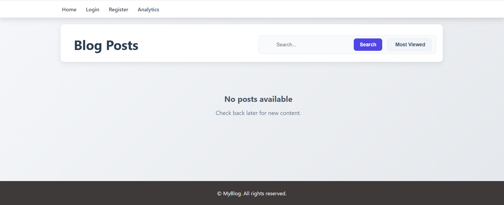

# 📝 Django Blogging Site

## 📌 Project Overview
This is a feature-rich blogging web application built with the Django framework.  
It allows users to create, manage, and share blog posts, organize them into categories, and interact through comments.  

## 📸 Screenshots

### 1️⃣ Admin Dashboard in Website


### 2️⃣ Admin


### 3️⃣ Home Page


### 4️⃣ Login Page


### 5️⃣ Registration Page


### 6️⃣ Analytics


## ⚙️ Prerequisites
- Python 3.9 or higher  
- Django (latest stable release recommended)  
- pip (Python package manager)  
- Virtual environment tool (e.g., venv or conda)  

## 🚀 Installation & Setup

```bash
# 1. Clone the repository
git clone https://github.com/mzain-tech/Blogging-site.git
cd Blogging-site

# 2. Create and activate a virtual environment
python -m venv venv
# On Windows
venv\Scripts\activate
# On Mac/Linux
source venv/bin/activate

# 3. Install dependencies
pip install -r requirements.txt

# 4. Apply database migrations
python manage.py migrate

# 5. Create a superuser
python manage.py createsuperuser

# 6. Run the development server
python manage.py runserver

# 7. Open the project in your browser
http://127.0.0.1:8000/
